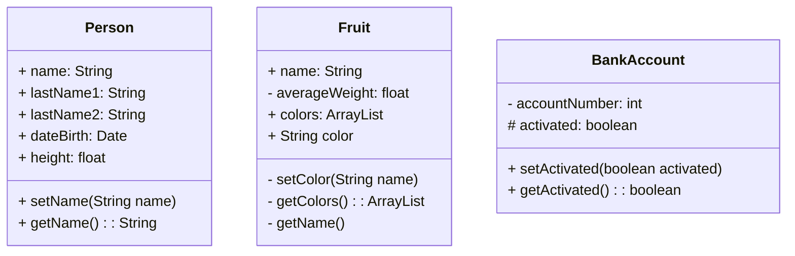
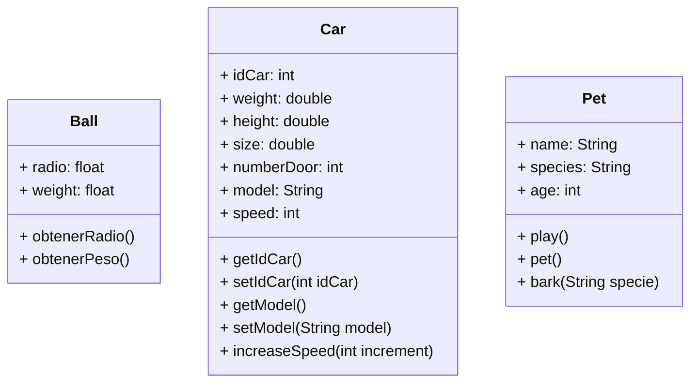

# IntroductionPOO_JAVA

IntroductionPOO_JAVA is a JAVA project excercises that contain 6 kind of classes with their attribute, constructors and methods.

## Installation

Just cpoy-paste the file repository on your NETBEANS project directory.
Teh local directory used was: 
```bash
C:\Users\XXXXX\Documents\NetBeansProjects\IntrodutionObjetcs
```

## Classes





## Contributing
Pull requests are welcome. For major changes, please open an issue first to discuss what you would like to change.

Please make sure to update tests as appropriate.

## License
[MIT](https://choosealicense.com/licenses/mit/)